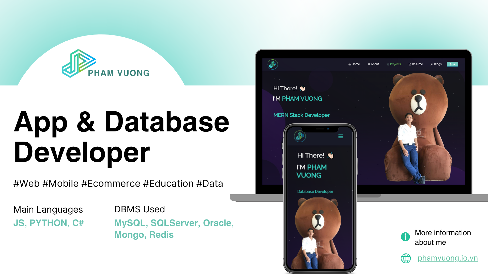

<h2 align="center">
  Portfolio Website - v2.0 
  <a href="https://phamvuong.io.vn/" target="_blank">phamvuong.io.vn</a>
</h2>

  

 

 &nbsp;
 &nbsp;
 &nbsp;
 &nbsp;

<h3 align="center">
    🔹
    <a href="https://github.com/phamvuong2002/My_Portfolio/issues">Report Bug</a> &nbsp; &nbsp;
    🔹
    <a href="https://github.com/phamvuong2002/My_Portfolio/issues">Request Feature</a>
</h3>

## TL;DR

You can fork this repo to modify and make changes of your own. Please give me proper credit by linking back to [Pham Vuong](https://github.com/phamvuong2002/My_Portfolio). Thanks!

## Built With

My personal portfolio <a href="https://phamvuong.io.vn/" target="_blank">phamvuong.io.vn</a> which features some of my GitHub projects as well as my resume and technical skills. 

This project was built using these technologies:

- React.js
- Node.js
- Express.js
- CSS3
- VsCode
- AWS

## Features

**📖 Multi-Page Layout**

**🎨 Styled with React-Bootstrap and CSS with easy to customize colors**

**📱 Fully Responsive**

## Getting Started

Clone down this repository. You will need `node.js` and `git` installed globally on your machine.

## 🛠 Installation and Setup Instructions

1. Installation: `npm install`

2. In the project directory, you can run: `npm start`

Runs the app in the development mode. 
Open [http://localhost:3000](http://localhost:3000) to view it in the browser. 
The page will reload if you make edits.

## 🚀 Deployment on AWS

1. Build the project: `npm run build`

2. Deploy the built files to an S3 bucket or use AWS Amplify for hosting.

3. Configure your domain in Route 53 if using a custom domain.

4. Use CloudFront for better performance and security.

## Usage Instructions

Open the project folder and navigate to `/src/components/`.  
You will find all the components used and you can edit your information accordingly.

### Show your support

Give a ⭐ if you like this website!

